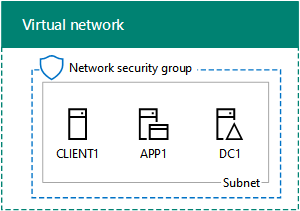

# TLG (Test Lab Guide) - 3 VM Base Configuration (v1.0)

**This version configured to be deployed from the oualabadmins/lab_deploy repo.** See the section _MAX notes_ below for information on how to deploy for MAX Skunkworks lab admins.

**Time to deploy**: Approx. 40 minutes

Last updated _7/17/2018_

This template deploys the **TLG (Test Lab Guide) 3 VM Base Configuration**, a Test Lab Guide (TLG) configuration that represents a simplified intranet connected to the Internet. This base configuration is the starting point for additional TLGs that can be found [here](http://aka.ms/catlgs).

The **TLG (Test Lab Guide) 3 VM Base Configuration** provisions a Windows Server 2012 R2 or 2016 Active Directory domain controller using the specified domain name, an application server running Windows Server 2012 R2 or 2016, and optionally a client VM running Windows 10. 

**Note:** If you choose to deploy a client VM, you must upload a generalized Windows 10 VHD to an Azure storage account and provide the account name in the _clientVhdUri_ parameter. Note that SAS tokens are not supported, and the blob container must be configured for public read access.

Use of a custom client image is required because the Windows 10 gallery image is only available in eligible subscriptions (Visual Studio or MSDN). The path to the VHD should resemble the following example:

     https://<storage account name>.blob.core.windows.net/vhds/<vhdName>.vhd
* For more information about eligible subscriptions, see https://docs.microsoft.com/en-us/azure/virtual-machines/windows/client-images#subscription-eligibility.
* For more information about how to prepare a generalized VHD, see https://docs.microsoft.com/en-us/azure/virtual-machines/windows/prepare-for-upload-vhd-image.

## Usage

You can deploy this template in one of two ways:

+ Click the "Deploy to Azure" button to open the deployment UI in the Azure portal
+ Execute the PowerShell script at https://raw.githubusercontent.com/oualabadmins/lab_deploy/master/tlg-base-config_3-vm/scripts/Deploy-TLG.ps1 on your local computer.

## Credits
Thanks to both Simon Davies and Willem Kasdorp, from whom I borrowed various DSC configuration elements.

## Solution overview and deployed resources

The following resources are deployed as part of the solution:

+ **ADDC VM**: Windows Server 2012 R2 or 2016 VM configured as a domain controller and DNS with static private IP address
+ **App Server VM**: Windows Server 2012 R2 or 2016 VM joined to the domain. IIS and .NET 4.5 are installed, and the directory C:\Files containing the file example.txt is shared as "\\APP1\Files" with full control for the User1 domain account.
+ **Client VM**: Windows 10 client joined to the domain
+ **Storage account**: Diagnostics storage account, and client VM storage account if indicated. ADDC and App Server VMs in the deployment use managed disks, so no storage accounts are created for VHDs.
+ **NSG**: Network security group configured to allow inbound RDP on 3389
+ **Virtual network**: Virtual network for internal traffic, configured with custom DNS pointing to the ADDC's private IP address and tenant subnet 10.0.0.0/8 for a total of 16,777,214 available IP addresses.
+ **Network interfaces**: 1 NIC per VM
+ **Public IP addresses**: 1 static public IP per VM. Note that some subscriptions may have limits on the number of static IPs that can be deployed for a given region.
+ **JoinDomain**: Each member VM uses the **JsonADDomainExtension** extension to join the domain.
+ **BGInfo**: The **BGInfo** extension is applied to all VMs.
+ **Antimalware**: The **iaaSAntimalware** extension is applied to all VMs with basic scheduled scan and exclusion settings.

## Solution notes

* All guest OS configuration is executed with DSC, using the resources CreateADPDC.ps1.zip and AppConfig.ps1.zip.
* The domain user *User1* is created in the domain and added to the Domain Admins group. User1's password is the one you provide in the *adminPassword* parameter.
* The *App server* and *Client* VM resources depend on the **ADDC** resource deployment in order to ensure that the AD domain exists prior to execution of 
the JoinDomain extensions for the member VMs. This asymmetric VM deployment process adds several minutes to the overall deployment time.
* The private IP address of the **ADDC** VM is always *10.0.0.10*. This IP is set as the DNS IP for the virtual network and all member NICs.
* The default VM size for all VMs in the deployment is Standard_D2_v2.
* Deployment outputs include public IP address and FQDN for each VM.

## MAX notes

* **IMPORTANT**: Only deploy this template into a subscription with no ExpressRoute circuit. Use _MAXLAB R&D EXT 1_, _MAXLAB R&D EXT 2_ or _MAXLAB R&D Sandbox_.
* You can test client VM deployment using the custom Windows 10 image at https://sandboxwusimages.blob.core.windows.net/vhds/Win10.vhd. Enter that value into the **clientVhdUri** field, make sure the value of **deployClientVm** is _Yes_, and then deploy to the _West US_ region, which is where the storage account containing the image resides.
* If you are deploying from a private repo, get the token by opening a file from the repo in the browser and click the "Raw" button. The token will be at the end of the URL in the address field, starting with "?token=_string_". Add the token (including ?token=) to the **_artifactsLocationSasToken** parameter.

`Tags: TLG, Test Lab Guide, Base Configuration`
___
Developed by the **MAX Skunkworks Lab**  
Author: Kelley Vice (kvice@microsoft.com)  
https://github.com/maxskunkworks

